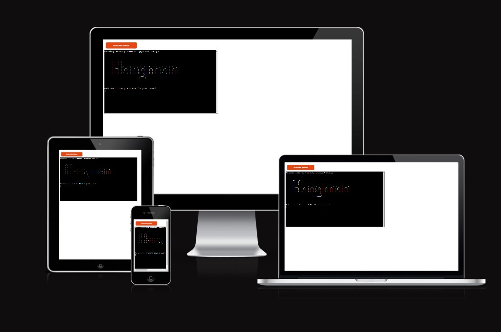
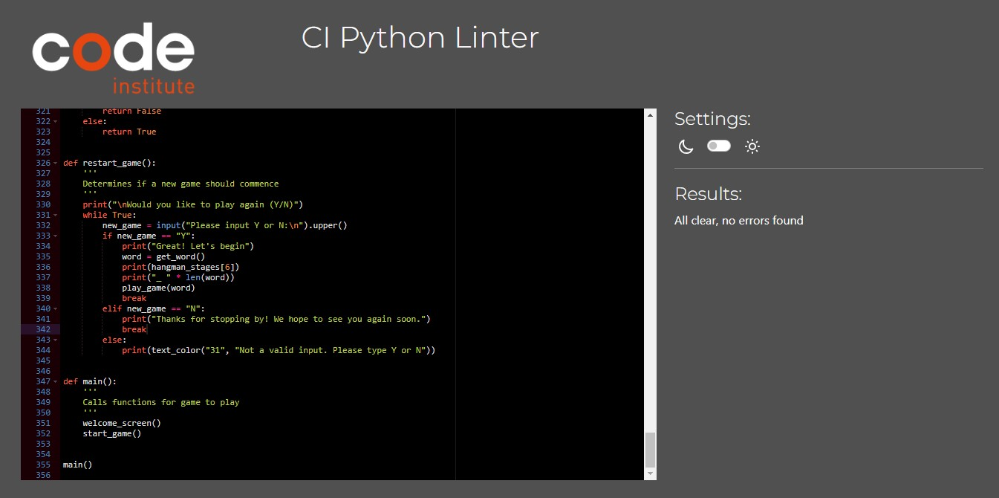
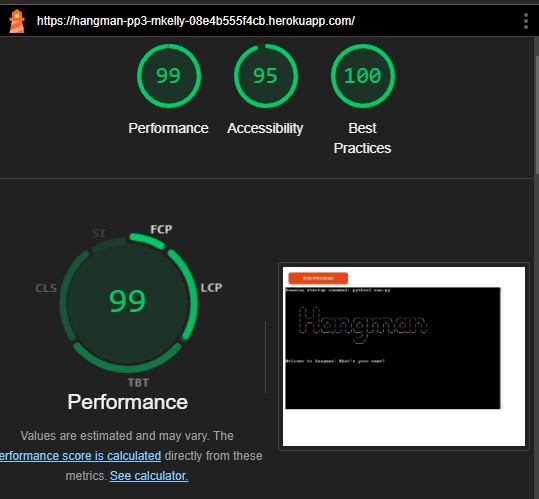

# Hangman Game

## Index - Table of Contents
* [Introduction](#introduction)
* [User Experience (UX)](#user-experience-ux) 
    * [Site Goals](#site-goals) 
* [Design](#design)
    * [Colour](#colour)
    * [Fonts](#fonts)
    * [Flowchart](#flowchart)
* [Features](#features)
    * [Title](#title)
    * [Introduction](#introduction---home-screen)
    * [How To Play Section](#how-to-play-section)
    * [Main Question Display](#main-question-display)
* [Technologies Used](#technologies-used)
    * [Languages, Frameworks, Libraries & Programs Used](#languages-frameworks-libraries--programs-used)
* [Testing](#testing)
    * [Validator Testing](#validator-testing)
    * [Lighthouse Testing](#lighthouse-testing)
    * [Additional Manual Testing](#additional-manual-testing)
    * [User Story Testing](#user-story-testing)
    * [Browser Compatibility](#browser-compatibility)
    * [Bugs](#bugs)
    * [Known Bugs](#known-bugs)
* [Deployment](#deployment)
    * [How This Site Was Deployed](#how-this-site-was-deployed)
    * [How to Clone The Repository](#how-to-clone-the-repository)
* [Credits](#credits)
    * [Code](#code)
    * [Acknowledgments](#acknowledgments)

## Introduction
This is a terminal based Hangman game. 

The overall goal of this game is for the user to guess letters to complete a secret word. With each incorrect guess another peice of a stick figure man is hung from the gallows. You must complete the word before the figure is completed. 

The game targets primary school children (ages 8-12) who are looking to test their vocabulary and spelling skills. However, older children and adults could also benefit from playing!   

## User Experience (UX)

### Site Goals

#### Site Owner Goals
As the Site Owner, I want to create a game that:
  1. captures and holds a users attention.
  2. is educational.

### User Goals
 As a User, I want to:
  1. easily understand the purpose of the game
  2. easily view instructions on how to play the game.
  3. easily and intuitively interact with the game.
  4. be able to see how many guesses I have remaining.
  5. be able to which letters I have correctly guessed. 
  6. be able to easily see the result of the game and be able to play again.

## Design

### Colour
As this is a terminal based game the main colour scheme is white and black. Coloured text is introduced to enhance the user experience and draw attention to warning messages. Red is used for invalid input messages and incorrrect guess messages. Green text is used for correct guesses and to alert the user if they won the game.

### Flowchart

Flowchart

## Features

### Introduction Screen
- The introduction screen features ASCII art to display to the user that they are playing a hangman game. It also contains a feature asking the user for their name to display a personalized message to ask if they would like to view instructions and are ready to play the game. 

### Instruction Screen
- The instruction screen gives a brief description of how the game is played in the event the user is unfamiliar with it. 

### Game Display
- The main display screen displays the hangman figure along with 

### Future Features
In the future, this game could be further developed to include the following:
   - A leaderboard to track high scorers. 
   - A user account feature.

## Technologies Used

### Languages
- Python

### Frameworks, Libraries & Programs Used
- Random Python Library
- Heruko
- GitPod
- GitHub
- CI Python Linter
- Lucid Chart

## Testing

### Validator Testing
- [CI PEP8 Linter](https://pep8ci.herokuapp.com/)

 

### Lighthouse Testing
- Lighthouse results:

 

### Additional Manual Testing

### User Story Testing

### Site Owner Goals
1. 

### User Goals
1. 

### Browser Compatibility
This website was tested on the following browsers:
- Google Chrome Version 127.0.6533.89 (Official Build) (64-bit)
- Microsoft Edge Version 127.0.2651.86 (Official build) (64-bit)
- Mozilla Firefox Version 128.0.3 (64-bit)

### Bugs

### Known Bugs
There are no unaddressed known bugs at this time. 

## Deployment

### How This Site Was Deployed

## Credits

### Code

1. 

### Acknowledgments

1. My mentor Dick Vl