# Hangman Game

## Index - Table of Contents
* [Introduction](#introduction)
* [User Experience (UX)](#user-experience-ux) 
    * [Site Goals](#site-goals) 
* [Design](#design)
    * [Colour](#colour)
    * [Flowchart](#flowchart)
* [Features](#features)
    * [Introduction Screen](#introduction-screen)
    * [Instruction Screen](#instruction-screen)
    * [Difficulty Level Screen](#difficulty-level-screen)
    * [Game Display](#game-display)
    * [Display Messages](#display-messages)
    * [Future Features](#future-features)
* [Technologies Used](#technologies-used)
    * [Languages](#languages)
    * [Frameworks, Libraries & Programs Used](#frameworks-libraries--programs-used)
* [Testing](#testing)
    * [Validator Testing](#validator-testing)
    * [Lighthouse Testing](#lighthouse-testing)
    * [Additional Manual Testing](#additional-manual-testing)
    * [User Story Testing](#user-story-testing)
    * [Browser Compatibility](#browser-compatibility)
    * [Bugs](#bugs)
    * [Known Bugs](#known-bugs)
* [Deployment](#deployment)
    * [How This Site Was Deployed](#how-this-site-was-deployed)
    * [How to Clone The Repository](#how-to-clone-the-repository)
* [Credits](#credits)
    * [Code](#code)

## Introduction
This is a terminal based Hangman game. 

The overall goal of this game is for the user to guess letters to complete a secret word. With each incorrect guess another peice of a stick figure man is hung from the gallows. You must complete the word before the figure is completed. 

The game targets primary school children (ages 8-12) who are looking to test their vocabulary and spelling skills. However, older children and adults could also benefit from playing!   

## User Experience (UX)

### Site Goals

#### Site Owner Goals
As the Site Owner, I want to create a game that:
  1. captures and holds a users attention.
  2. is educational.

### User Goals
 As a User, I want to:
  1. easily understand the purpose of the game
  2. easily view instructions on how to play the game.
  3. easily and intuitively interact with the game.
  4. be able to see how many guesses I have remaining.
  5. be able to which letters I have correctly guessed. 
  6. be able to see which letters and words I have already guessed, whether correct or incorrect. 
  7. be able to easily see the result of the game and be able to play again.

## Design

### Colour
As this is a terminal based game the main colour scheme is white and black. Coloured text is introduced to enhance the user experience and draw attention to warning messages. Red is used for invalid input messages and incorrrect guess messages. Green text is used for correct guesses and to alert the user if they won the game.

### Flowchart

#### Flowchart
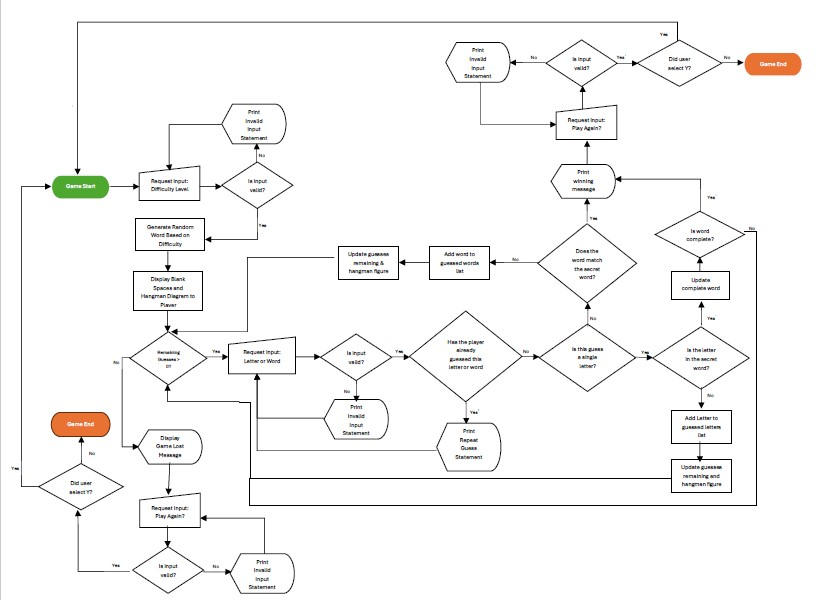

Full PDF Version Available:  <a href="https://github.com/michelleduda/hangman/blob/main/documentation/flowchart.pdf" target="_blank">Hangman Flowchart</a>

## Features

### Introduction Screen
- The introduction screen features ASCII art to display to the user that they are playing a hangman game. It also contains a feature asking the user for their name to display a personalized message to ask if they would like to view instructions and are ready to play the game. 

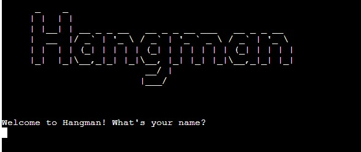

### Instruction Screen
- The instruction screen gives a brief description of how the game is played in the event the user is unfamiliar with it. After the instructions display the user is asked whether or not they would like to start a new game. If they select “N” the game will end. If they select “Y” a new game will initialize and they will be directed to select a difficulty level. Error handling is in place for the function that controls this selection. If a user enters anything other than “Y” or “N” an error message will display and they will be prompted to enter a selection again until valid data is input. 

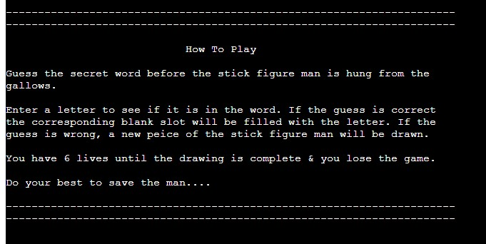

### Difficulty Level Screen
- The difficulty level screen was implemented to allow users to have more control over the difficulty of the word they are trying to guess. Easy will generate a 4 letter word. Medium will generate a 5 letter word. Hard will generate a 6 letter word. Error handling is in place for the function that controls this selection. If a user enters anything other than “1” “2” or “3” an error message will display and they will be prompted to enter a selection again until valid data is input.

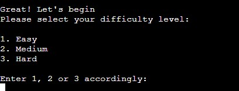

### Game Display
- The main screen consists of a picture of the gallows that updates with the appropriate version of the hangman figure, based on how many incorrect guesses the user has made at any specific time. The screen also displays to the user the number of guesses they have remaining, the letters and words they have already guessed, as well as a printout of the secret word with underscores in any position where they have not correctly identified the letter yet and the correct letters they have guessed.  

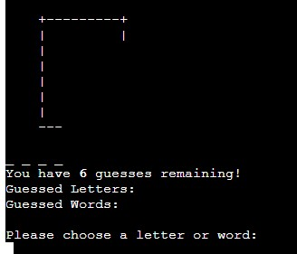

See [flowchart](#flowchart) for a description of game details and error handling.

### Display Messages
- The game contains several display messages for invalid input or incorrect guesses. These messages are colored in red to enhance the user experience and make them stand out from the other elements of the game. Red was chosen as it indicates something either unfavorable or incorrect. 

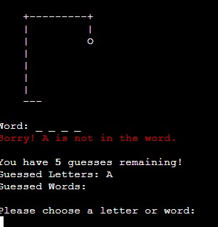
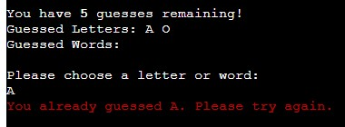
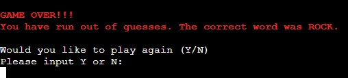
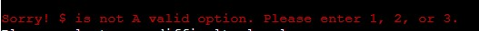

- The game also contains display messages for correct guesses and for winning the game. These message are colored in green to enhance the user experience and make them stand out from the other elements of the game. Green was chosen as it indicates something either favorable or correct. 

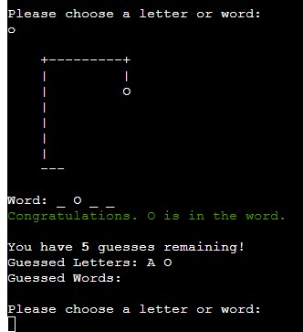
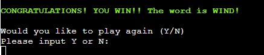

### Future Features
In the future, this game could be further developed to include the following:
   - A leaderboard to track high scorers. 
   - A user account feature.

## Technologies Used

### Languages
- Python

### Frameworks, Libraries & Programs Used
- Random Python Library
- Heruko
- GitPod
- GitHub
- CI Python Linter
- Microsoft Word was used for the flowchart
- Notepad was used to construct hangman figures

## Testing

### Validator Testing
- [CI PEP8 Linter](https://pep8ci.herokuapp.com/)

 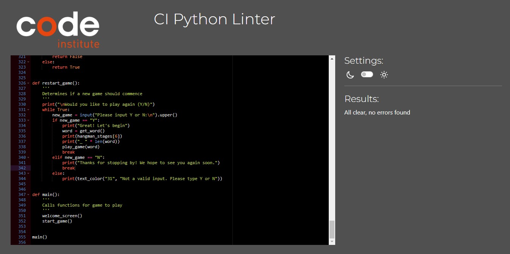

### Lighthouse Testing
- Lighthouse results:

 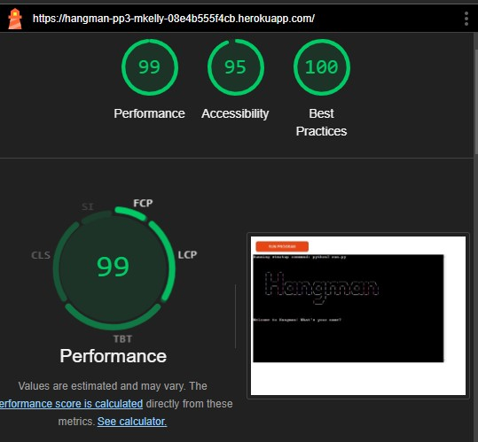

### Additional Manual Testing
| ID                       | Feature Tested                                 | Steps                                                           | Expeted Outcome                                                                                                                                                                                                                                                                                                                                                                               | Results           |
| ------------------------ | ---------------------------------------------- | --------------------------------------------------------------- | --------------------------------------------------------------------------------------------------------------------------------------------------------------------------------------------------------------------------------------------------------------------------------------------------------------------------------------------------------------------------------------------- | ----------------- |
| Home/Introduction Screen |                                                |                                                                 |                                                                                                                                                                                                                                                                                                                                                                                               |
| T01                      | UX - Title                                     | Check positioning and readability of title                      | ASCII art is legible and positioned properly.                                                                                                                                                                                                                                                                                                                                                 | Works As Expected |
| T02                      | Input - Name                                   | Enter Name                                                      | See personalized message welcoming user by name to the game.                                                                                                                                                                                                                                                                                                                                  | Works As Expected |
| T03                      | Input - Instructions                           | Input N in prompt to display game instructions                  | Skip the game instructions and ask user if they are ready to play the game                                                                                                                                                                                                                                                                                                                    | Works As Expected |
| T04                      | Input - Instructions                           | Input Y in the prompt to display game instructions              | Game instructions will be displayed along with a message at the bottom asking if user is ready to play the game                                                                                                                                                                                                                                                                               | Works As Expected |
| T05                      | UX - Instructions                              | Check positioning and readability of instructions               | Instructions are legible and positioned properly. Clearly explain how to play the game and how many lives you have.                                                                                                                                                                                                                                                                           | Works As Expected |
| Main Game Screen         |                                                |                                                                 |                                                                                                                                                                                                                                                                                                                                                                                               |
| T06                      | Input - Start Game                             | Input N in prompt to start new game                             | Display message to thank user for stopping by. End game                                                                                                                                                                                                                                                                                                                                       | Works As Expected |
| T07                      | Input - Start Game                             | Input Y in prompt to start new game                             | An input prompt will come up asking the user to select the difficulty level                                                                                                                                                                                                                                                                                                                   | Works As Expected |
| T08                      | Input - Difficulty Level                       | Input 1 and press enter. Repeat for difficulty levels 2 & 3     | A new game will appear. A random word will be chosen. An empty picture of the gallows will appear along with a visual of the word completed thus far (in this case a series of underscores showing how long the word is). The terminal will also display the remaining guesses, a blank list of already guessed words and letters. The user will be prompted to enter a letter or word guess. | Works As Expected |
| T09                      | UX - Main Game Screen                          | Check positioning and readability of game screen                | Text/ASCII Art is legible and positioned properly. Image of gallows is shown (with corresponding hangman figure stage), the correct letters in the guessed word are clearly displayed beneath the gallows along with a message displaying how many guesses remain and previously guessed letters and words.                                                                                   | Works As Expected |
| T10                      | Input - Correct Letter                         | Input a letter that is not contained within the secret word     | A message to appear stating that the guess is correct, the letter will be added to the guessed letters list. The appropriate underscore in the word will be replaced with the correctly guessed letter, guesses will remain unchanged and the hangman figure will also remain unchanged. The user will be prompted to enter another guess (unless the word is complete).                       | Works As Expected |
| T11                      | Input - Incorrect Letter                       | Input a letter that is contained in the secret word             | A message to appear stating that the guess is incorrect, the letter will be added to the guessed letters list and displayed. The guess count will decrease by 1, no additional underscores in the word will be filled in . The user will be prompted to guess again (unless they are out of guesses).                                                                                         | Works As Expected |
| T12                      | Input - Correct Word                           | Input a word that matches the secret word                       | A message will appear congratulating the user on guessing the correct word and stating that they win the game. The full word will appear on the screen and final non-updated image of the hangman figure will display. The user will be asked if they would like to play again.                                                                                                               | Works As Expected |
| T13                      | Input - Incorrect Word                         | Input a word that does not match the secret word                | A message to appear stating that the guess is incorrect, the word will be added to the guessed words list and displayed. The guess count will decrease by 1, no additional underscores in the word will be filled in. The user will be prompted to guess again (unless they are out of guesses).                                                                                              | Works As Expected |
| T14                      | UX - User is out of guesses                    | Enter an incorrect letter with only 1 guess remaining           | A message will appear stating that the user ran out of guesses and the game is over. A final fully completed figure of the hangman on the gallows will appear and the user will be informed of what the correct word was. A message will appear asking the user if they would like to play again.                                                                                             | Works As Expected |
| T15                      | Input - Play Again                             | Input N when prompted to play again                             | A message will appear thanking the user for playing and the game will end.                                                                                                                                                                                                                                                                                                                    | Works As Expected |
| T16                      | Input - Play Again                             | Input Y when prompted to play again                             | The user will be brought back to the difficulty level selection screen and all variables will be set back to default.                                                                                                                                                                                                                                                                         | Works As Expected |
| Error Handling           |                                                |                                                                 |                                                                                                                                                                                                                                                                                                                                                                                               |
| T17                      | Error - Invalid Input - Game Instructions      | Enter a character other than Y or N                             | Error Message stating the input is not valid, stating that the user must only enter Y or N. Loop back to ask the user again if they would like to view the game instructions until they enter valid input.                                                                                                                                                                                    | Works As Expected |
| T18                      | Error - Invalid Input - Start Game             | Enter a character other than Y or N                             | Error Message stating the input is not valid, stating that the user must only enter Y or N. Loop back to ask the user again if they would like to start a new game until they enter valid input.                                                                                                                                                                                              | Works As Expected |
| T19                      | Error - Invalid Input - Select Difficulty      | Enter a character other than 1, 2, or 3                         | Error Message stating the input is not valid, stating that the user must only enter 1 2 or 3. Loop back to ask the user to select a difficulty level until they enter valid input.                                                                                                                                                                                                            | Works As Expected |
| T20                      | Error - Invalid Input - Letter Guess           | Enter a single character that is not a letter.                  | Error Message stating the input is not valid, stating that the user must only enter a single letter or a word equal in length to the secret word.  Loop back to ask the user to guess a letter or word until they enter valid input. This will not use one of the users available guesses.                                                                                                    | Works As Expected |
| T21                      | Error - Invalid Input - Word/MultiLetter Guess | Enter a word with fewer or more character than the secret word. | Error Message stating the input is not valid, stating that the user must only enter a single letter or a word equal in length to the secret word.  Loop back to ask the user to guess a letter or word until they enter valid input. This will not use one of the users available guesses.                                                                                                    | Works As Expected |
| T22                      | Error - Invalid Input - Restart Game           | Enter a character other than Y or N                             | Error Message stating the input is not valid, stating that the user must only enter Y or N. Loop back to ask the user again if they would like to start a new game until they enter valid input.                                                                                                                                                                                              | Works As Expected |

### User Story Testing

#### Site Owner Goals
  1. The use of ASCII art to display the title and the various stages of hangman along with the color coding of the various display messages help to capture the users attention and engage them more in the game. 
  2. The game is educational in that it helps to test and expand the user’s vocabulary. It also aids in spelling as the user will not  be able to complete the task without properly spelling the word. 

### User Goals
  1. I am easily able to understand the purpose of the game as the introduction screen clearly displays ‘HANGMAN’, the title of a very well known game. There is also an option to view instructions which lay out how to play in the event I am unfamiliar with it. 
  2. I am easily able to view the instructions, as after asking my name the first question that is then asked is whether or not I would like to view instructions. I have to input Y or N in order to proceed with the game. 
  3. I am able to easily interact with the game as there are clear input prompts that instruct me as to what I need to enter. If incorrect data is entered I am provided with a red warning message that let’s me know the data is not valid and what data I need to input. 
  4. I am able to easily see how many guesses I have remaining, as there is a line displayed with the number of remaining guesses after each guess I input.  
  5. I am able to easily see which letters I have guessed correctly as the hangman stage drawing and a partially filled in word containing my correctly guessed letters and underscores in the appropriate places are displayed before each guess.  
 6. I am able to easily see which letters and words I have already guessed as lists of both are displayed along with the hangman stage drawing and partially completed word at the beginning of each prompt for my next guess. 
  7. I am easily able to see the end result as a bright bold message is displayed in green if I won or in red if I lost. There is then a prompt asking whether or not I would like to play again. No will result in a message thanking me for playing, while yes will result in the game looping back to the beginning and asking me to choose a difficulty level. 

### Browser Compatibility
This website was tested on the following browsers:
- Google Chrome Version 129.0.6668.103 (Official Build) (64-bit)
- Microsoft Edge Version 130.0.2849.46 (Official build) (64-bit)
- Mozilla Firefox Version 128.0.3 (64-bit)

### Bugs
1. Error when trying to update word_completion list. This was due to not being able to enumerate because the list was initalized using word_completion = [" " * len(word)] which created a single string. Updated code to word_completion = ["_" for _ in word] to create the appropriate list. 
2. Game instuctions were appearing indented on the screen. Removed leading indentation spaces in multistring print statement to align text properly. 
3. Game only prompted user for the option to replay once. Added a loop to the function. 

### Known Bugs
There are no unaddressed known bugs at this time. 

## Deployment

### How This Site Was Deployed
This site was deployed via Heroku.
1. Log into Heroku (https://www.heroku.com).
2. Click on Create 'New App' button.
3. Name the app & choose your region. Click 'Create App' button.
4. Go to the Settings Tab.
5. In the Config Vars section, click 'Reveal Config Vars' button.
6. Enter PORT in the key field and 8000 in the value field. Then click 'Add' button.
7. Go to the Buildpacks section and click 'Add Buildpacks' button. 
8. Add Python and NodeJS buildpacks (Ensure Python is on top).
9. Go to the Deploy Tab.
10. Select GitHub in the Deployment Method section.
11. Confirm to connect to GitHub.
12. Search for repository name and click Connect.
13. Make sure branch is set to main and click 'Deploy Branch' button in Manual Deploy section. .

### How to Clone the Repository

To Clone this repository:
1. Navigate to [https://github.com/MichelleDuda/hangman](https://github.com/MichelleDuda/hangman).
2. Click on the "<> Code" button.
3. Copy the URL for the repository using HTTPS, SSH, or GitHub CLI. 
4. Open Git Bash.
5. Change the working directory to the location you want to clone the directory to. 
6. Type git clone and paste the URL that was copied earlier. 
7. Press Enter to begin the clone process. 

## Credits

### Code

1. [TabletoMarkdown.com](https://tabletomarkdown.com/convert-spreadsheet-to-markdown/) was used to convert my additional manual testing table from an excel spreadsheet to markdown.
2. [Kaggle.com](https://www.kaggle.com/discussions/general/273188) was used to help apply color to text. 
3. [https://patorjk.com/software/taag/#p=display&f=Big&t=Hangman%20](https://patorjk.com/software/taag/#p=display&f=Big&t=Hangman%20) was used to generate the hangman ASCII art. 
